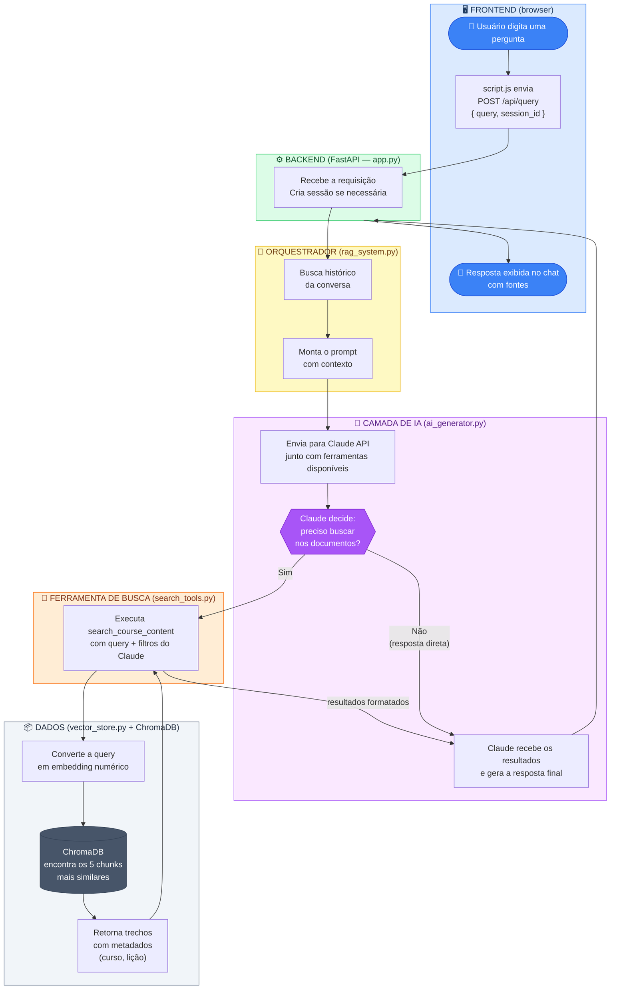

# Como uma pergunta do usuário é processada

---

## Passo a passo

| # | O que acontece | Arquivo |
|---|---|---|
| 1 | Usuário digita e envia a pergunta | `frontend/script.js` |
| 2 | Frontend faz `POST /api/query` com a pergunta e o ID da sessão | `frontend/script.js` |
| 3 | Backend recebe, cria sessão se necessário | `backend/app.py` |
| 4 | Orquestrador recupera histórico da conversa | `backend/session_manager.py` |
| 5 | Monta o prompt com o histórico e passa ao Claude | `backend/rag_system.py` |
| 6 | Claude decide se precisa buscar nos documentos | `backend/ai_generator.py` |
| 7 | **Se sim:** executa a ferramenta `search_course_content` | `backend/search_tools.py` |
| 8 | A pergunta vira um vetor numérico (embedding) | `backend/vector_store.py` |
| 9 | ChromaDB encontra os 5 trechos mais relevantes | ChromaDB |
| 10 | Os trechos voltam ao Claude para ele formular a resposta | `backend/ai_generator.py` |
| 11 | Resposta + fontes são enviadas ao frontend | `backend/app.py` |
| 12 | Chat exibe a resposta com as referências | `frontend/script.js` |
